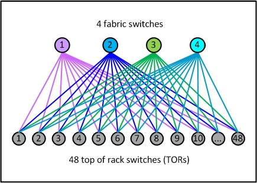
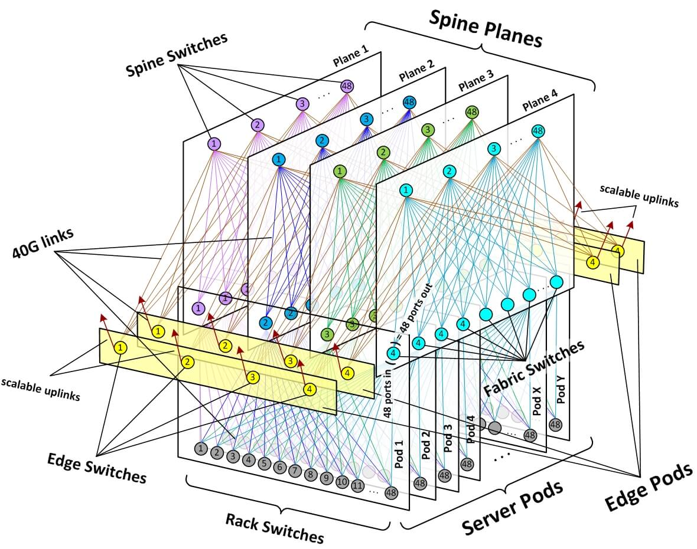
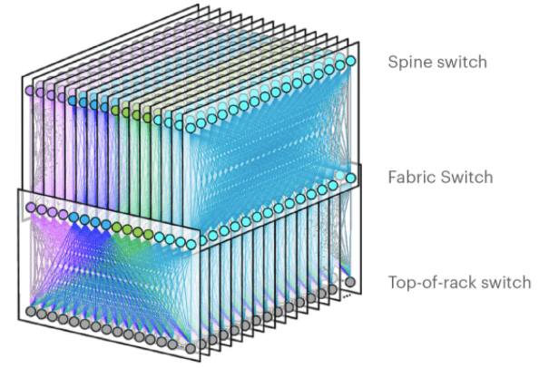
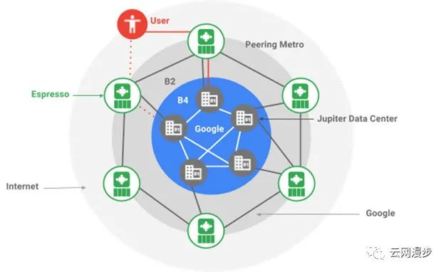

多年来，云计算持续增长，有前景的新兴云服务（如无服务（serverless）、AI 训练和数字办公）更加强化了这一趋势。大型企业将业务迁移至云端，以寻求灵活的扩展能力来应对不断变化的业务需求，这往往会带来网络峰谷现象。

随着云计算的发展，云网络的流量出现了爆发式增长。游戏／视频／NFV化对ECS网络性能提出了更高的要求，vSwitch的网络正在朝百Gbps迈进。混合云的发展带来了专线和跨region流量的激增，Gateway的流量正在朝百Tbps迈进。

小型化设备（降低边缘网络占用机柜空间）、多合一（在一台设备里集成所需要的功能）、低成本（降低边缘网络的成本）、稳定性（避免发生单核打爆风险）以及根据边缘场景灵活地按需组合网关功能，并尽可能地复用中心网络避免重复开发。

边缘云的网络方案的难点在于需要在狭小的空间内提供足够的性能，同时考虑压缩成本。

在数据平面上通过创新的流水线折叠layout到达了性能和表项存储空间的完美平衡。

在控制平面，基于BGP路由进行组件间的引流，并同时具备了故障切换和负载均衡的能力

（实际部署一年，取得的效果）成本降低75%，空间占用降低87%，在边缘场景对于ecs2local业务，提供约3-5us时延，1.2Tbps的吞吐量。

这种架构沿用了中心云的架构，多活保证健壮性，单组件挂掉可以切换；

组件中表项的数量较多，size较大，无法存储在单个Pipe中，将IGW和SW顺序排布在单根折叠后的Tofino流水线中
解决方法之一是对表项做水平拆分，但云网络的业务复杂，客户的配置变化快，水平拆分的难度大／成本高。解决方法之二是软硬结合+动态调整，通过速率计算动态检测大象流／长尾流，长尾流动态调整到软转发，大象流动态调整到硬转发，软硬一体／动态优化。

流水线布局也存在一些潜在问题：
将原来的四根Pipeline折叠成了一根，吞吐量降为1.6Tbps，且不同业务会竞争流水线资源；
大量Tofino的端口被用作内部loopback，无法挂载更多的NC。

融合网关中，在CPU上阿里云云网络提供了对有状态网元的支持，例如SLB等。
软件数据平面的高速转发行为不会影响控制平面表项的接收和下发
多个组件表项下发相互不影响

对于仅在Tofino中处理的业务，产生的时延差不多，保持在一个较低的水平，大约为3-4us。对于需要送往FPGA或x86处理的业务，产生的时延不仅要考虑两次经过Tofino的3个Pipeline的时间，还需要考虑在FPGA或x86处理的时间，相对较大。

大大降低了公有云网络设施部署的成本和机柜空间占用，能够将更多的成本和机柜空间预留给租户的算力设备。

展示了良好的技术竞争力。

虚拟网络控制器需要确保翻译后的配置能够及时且正确地配置在这些异构设备上。
在过去几年中，随着网络服务的增长，控制器的数量激增至50多个，这些都需要由不同的业务团队进行维护，使得我们的OpEx大幅增加。
过去的控制器开发需要编写SQL + if-else来查询与云资源和设备相关的表，这对开发者对云网络机制的理解提出了高要求。

对于控制器来说，关键性能指标是其并发处理能力和相应的完成时间。

由于物理网络和虚拟网络都会影响租户的网络性能，因此云厂商有必要对两层网络都进行探测，以保障租户的服务水平协议（SLA）。

VPC是云网络的基础，VPC的基础组件主要包括2部分：Gateway，vSwitch；Gateway是VPC的流量入口，负责公网／专线和跨region流量的汇聚和分发。vSwitch负责ECS的虚拟交换，和Gateway一起为客户搭建一张虚拟专用网。

挑战一：百万级别实例的配置更新时间为亚秒级（sub-second）
挑战二：适合大流量网络中间设备（middle-box/云网关）部署的高弹性网络
挑战三：云服务高可用性和高可靠性
首先，为了解决转发表较大和收敛速度较慢的挑战，我们提出了一种新颖的编程机制，该机制按需主动从网关而不是从控制器学习转发信息。
其次，为了在保证性能隔离的同时实现主机内的可扩展性，提出了弹性网络容量策略和分布式 ECMP 机制，并实现带宽和CPU资源的高利用率。
最后，我们提出了一种链路健康检查方案用来验证 vSwitch 和 VM 之间的网络链路状态，以及一个用于检测 vSwitch 本身状态的监视器。

云网络中最核心的两点是：高性能与大规模。

从流量模型看，Facebook 分为两种类型。
1、外部流量：到互联网的流量（Machine-to-User）。
2、内部流量：数据中心内部的流量（Machine-to-Machine）。
其中，Facebook 数据中心内部的流量要比到互联网的流量大几个数量级

BGP 注入器：集中式的 BGP 注入路由的控制方式。
sFlow 收集器：采集设备的状态传递给流量工程控制器。
Open / R：运行在网络设备上，提供 IGP 和消息传递功能。
LSP 代理（agent）：运行在网络设备上，代表中央控制器与设备转发表对接。

Facebook Network
Facebook 在骨干网、边缘网络都是使用 BGP 路由协议进行分布式控制，控制通道简单，避免多协议导致的复杂性，而对于流量工程采用集中的处理。

基础设施的核心设计哲学是具备下面两种能力：
快速演进（move fast）
支撑快速增长（support rapid growth）
同时，我们持续致力于保持网络基础设施足够简单（simple enough），以便我们规 模较小、效率非常高的工程师团队（small, highly efficient teams of engineers）来管理。
我们的目标是：不管规模多大以及如何指数级增长，部署和维护网络基础设施都能够 越来越简单和快速（faster and easier）。

更难的是，如何在集群大小（cluster size）、机柜带宽（rack bandwidth）和 出集群带宽（bandwidth out of the cluster）之间维护一个最优的长期平衡（ optimal long-term balance）。
“集群”（cluster）的整个概念就是从网络受限（networking limitation）的情境 中诞生的：

将大量计算资源（服务器机柜）集中到一个高性能网络区域
由大型集群交换机能提供很高的内部容量（internal capacity）
fabric 设计
1. 网络单元要小很多
每个 POD 只有 48 个服务器机柜，并且所有 POD 将都是这个大小。
这种尺寸的组建模块（building block）非常高效，能匹配各数据中心的多种室内规划， 并且只需基本的中型交换机来汇聚 TOR。
fabric 交换机更小的端口密度使得它们的内部架构非常简单、模块化和健壮， 并且这种设备能够很容易从多家厂商采购。
2. 另一个显著不同是POD 之间如何连接，形成一个数据中心网络。
TOR 交换机的端口五五分：一半向下连接服务器，一半向上连接 fabric 交换机。
这使得我们在理论上能获得非阻塞（statistically non-blocking）的网络性能。

1. 创建了 4 个独立的 spine 交换机平面（“planes” of spine switches），每个平 面最多支持 48 台独立设备。
2. 每个 POD 内的每台 fabric 交换机，会连接到其所在 spine 平面内的每台 spine 交换机。
3. POD 和 spine 平面提供了一个模块化的网络拓扑，能够提供几十万台 10G 接入交换机， 以及 PB 级跨 POD 带宽（bisection bandwidth），使得数据中心 building 实现 了无超售的机柜到机柜性能（non-oversubscribed rack-to-rack performance）。

 如何落地：https://arthurchiao.art/blog/facebook-f4-data-center-fabric-zh/

 2019年演进的架构
 

Google Network

Google 的广域网实际上分为 B2 全球骨干网和 B4 数据中心互联网
B2：面向用户的骨干网，用于连接 DC、CDN、POP、ISPs 等。B2 主要承载了面向用户的流量，和少部分内部流量（10%），带宽昂贵，整体可用性要求很高，利用率在 30%~40%之间。B2 采用商用路由器设备，并且运行 MPLS RSVP-TE 进行流量工程调节。
B4：数据中心内部数据交换的网络，网络节点数量可控，带宽庞大，承载的 Google 数据中心间的大部分流量。B4 承载的业务容错能力强，带宽廉价，整体利用率超过 90%。使用自研交换机设备，为 Google SDN 等新技术的试验田。

Amazon Global Network
设计理念
安全性：安全是云网络的生命线。
可用性：需要保证当某条线路出现故障的时候，不会影响整个网络的可用性。
故障强隔离：当网络发生故障的时候，尽量把故障限制在某个区域内。
蜂窝架构：一个个网络模块构成的蜂窝式网络架构。
规模：支撑上百万客户的应用网络需求。
性能：对网络的吞吐量、延迟要求较高。

Microsoft Network Azure网络
Microsoft SWAN架构
RSVP-TE/SR-TE。
集中式 TE 资源分配算法。
服务间通过资源分配模块协作。
每个 Host 上都有代理，负责带宽请求和限流。

从技术的角度看，互联网公司的网络演进是一个 SDN 的过程。SDN 是一个网络标准化的过程，是一个通信系统互联网化的状态，贯穿着网络的控制面、转发面、管理面。

从运营的角度看，互联网公司的网络演进是从“所有流量 all in one” 到互联网思路构建网络，网络具有分布式、模块化、低耦合等特点。

从布局的角度看，互联网公司的网络布局也是技术实力全球化扩张的缩影。也希望中国的互联网公司也能不断的扩张边界，进入全球化的食物链的顶端。