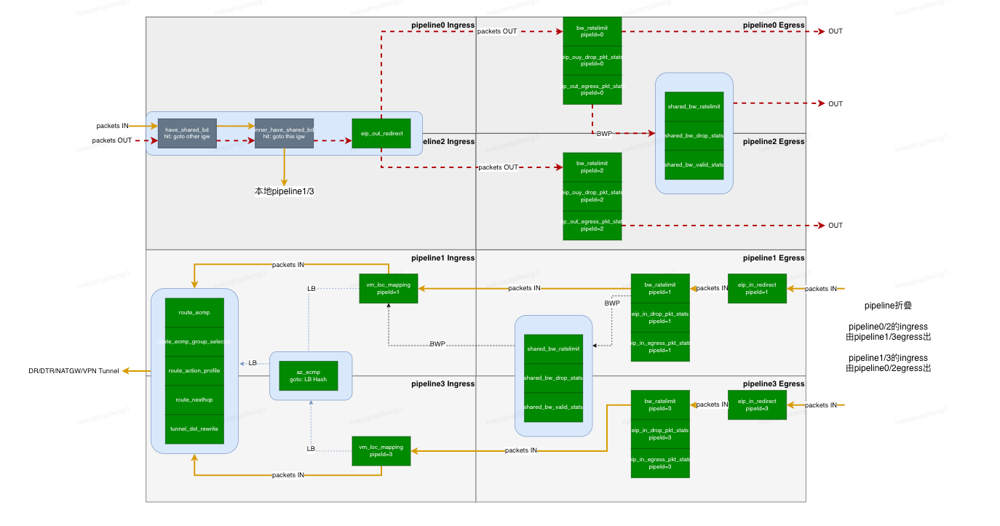
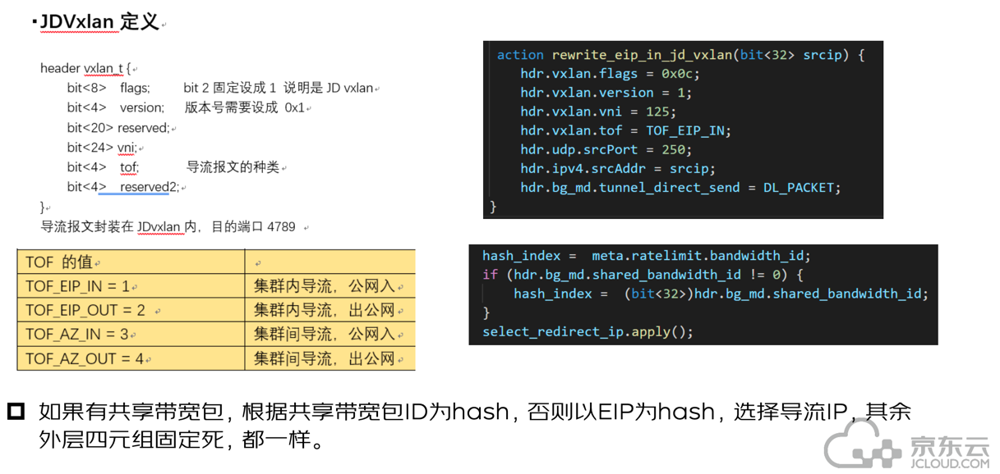
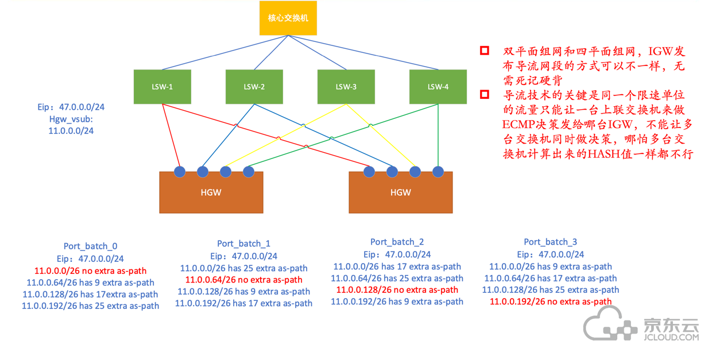
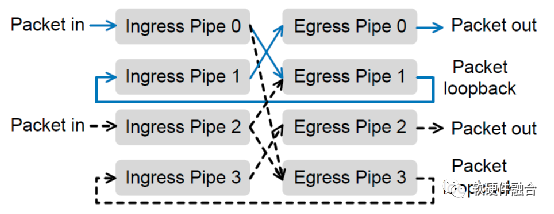
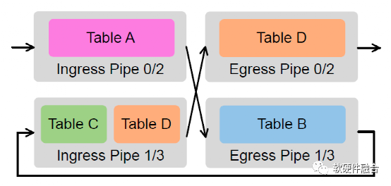
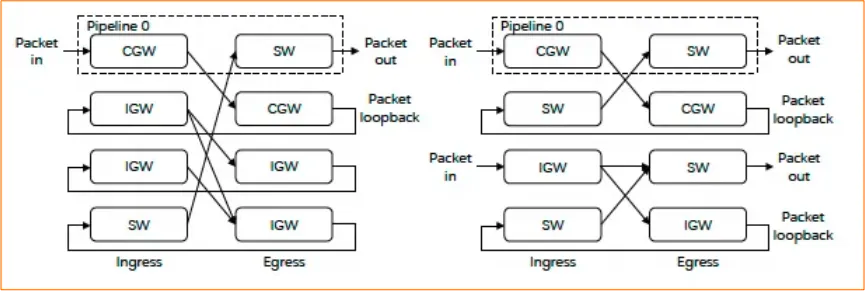

## 流表
**橙色**是公网入  
**红色**是公网出  
注意入方向的限速和流表是经过：  
pipeline0/2 ingress ---- pipeline1/3 egress ----pipeline1/3 ingress ----pipeline0/2 egress  
这种方式为Loopback模式 

## 如何区分接收的流量
所有的流量从pipe02Ingress的网络物理接口接收  
**公网入**：从交换机接收到的报文没有Vxlan标记  
**公网出**：从交换机接收到的报文有Vxlan标记，但没有TOF导流标记  
**公网入集群间导流后报文**：从交换机接收的有Vxlan标记，有TOF=3集群内导流标记  
**公网出集群间导流后报文**：从交换机接收的有Vxlan标记，有TOF=4集群内导流标记  
**公网入集群内导流后报文**：从交换机接收的有Vxlan标记，有TOF=1集群内导流标记  
**公网出集群内导流后报文**：从交换机接收的有Vxlan标记，有TOF=2集群内导流标记  

## 理解导流逻辑
可以查看joyspace：[导流限速方案讲解](./)  
**集群间导流**：BWP带宽包需要  
**集群内导流**：所有的IP限速需要  

## 理解pipeline折叠
“流水线折叠”作为一种折衷，以牺牲吞吐量来获得双倍的内存容量以存储更多的表条目。  
这种设计除了将转发吞吐量减半外，该设计还将转发延迟加倍。然而，添加O（1 μ S）到所述端至端延迟最终用户是察觉不到的。  
这个图直接看下面的 **[参考资料2](https://aijishu.com/a/1060000000254245#item-7-1)** “Pipeline 折叠”  

这个图直接看下面的 **[参考资料1](https://mp.weixin.qq.com/s/Okzey5SuEHdiW9dpsE9aPg)** “流水线折叠”  

## 性能借鉴
基于Barefoot的Tofino硬件可编程交换机实现的“洛神”XGW-H高性能网关，其性能比XGW-x86：

XGW-H的吞吐量是XGW-x86的20倍以上；  
XGW-H的包速率是XGW-x86的72倍；  
XGW-H的平均时延比XGW-x86低95%。

## 参考资料
1. [NSDI'24 | 阿里云飞天洛神云网络论文解读——《LuoShen》揭秘新型融合网关 洛神云网关](https://mp.weixin.qq.com/s/Okzey5SuEHdiW9dpsE9aPg)
2. [阿里SIGCOMM重磅论文，洛神Sailfish可编程网关](https://aijishu.com/a/1060000000254245#item-7-1)